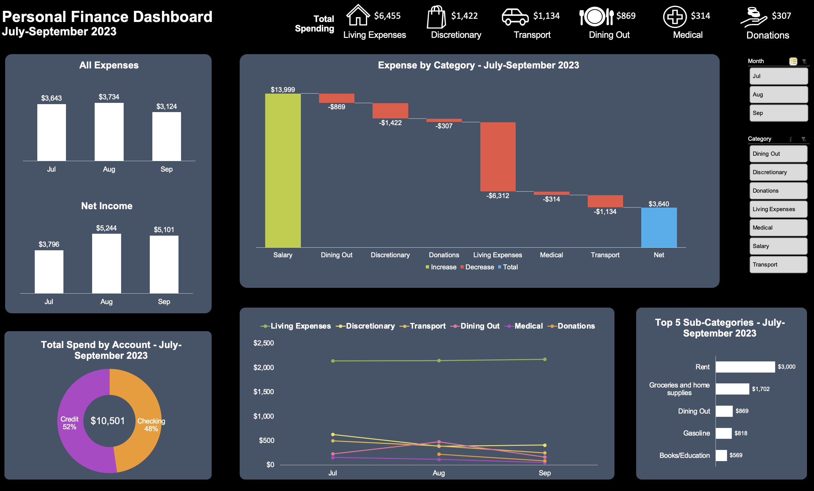

# ExcelFinanceDashboard

## Introduction
I was asked to build a dashboard for a friend and her husband who wanted to gain more insight into their monthly personal spending.

Excel concepts applied:
- **Data cleaning and manipulation**: Find and replace, data validation, TRIM, LEFT, XLOOKUP functions, value conversion
- **Analysis**: Pivot tables and pivot charts
- **Dashboarding**: Slicers, conditional chart titles 

## Problem Statement
1.	How is overall spending changing over time, and which categories are driving this change?
2.	What are the top sub-categories by spend overall and by month?
3.	What percentage of money is being spent in each account – checking vs credit cards?

## Data Sourcing
The file was downloaded from their banking website and filtered to include the last 3 months of data.

Description of columns:
- Account Name – whether the transaction was made with debit card (checking) or credit card (credit)
- Date – date of purchase
- Description – description of purchase _(please note that the descriptions have been trimmed using find and replace, as well as TRIM and LEFT functions to remove sensitive information)_
- Debit – amount of money spent
- Credit – amount of money earned 

## Data Transformation/Cleaning
- Created filters from the headings in order to enable column sorting
- Converted financial data to currency without decimal places
- Populated Amount column by subtracting the Debit column from the Credit column
- Created a separate sheet including a data validation list for sub-categories, along with their corresponding categories and category types
- Sorted transactions into appropriate sub-categories in the Sub-Category column using the data validation list
- Populated Category and Category Type columns using XLOOKUP function

## Data Analysis and Visuals
First, I created pivot tables and charts to parse out the data by the following cuts:
- Debit categories x sum of debit – Amount spent in each debit category for entire 3 month time period
- Date x sum of debit – Total spending by month
- Date x sum of credit – Total income by month
- Date & debit categories x sum of debit – Spending per category by month
- Account type x sum of debit – Percentage of spending by checking account vs credit card
- Spending categories x sum of amount – Amount spent (debits) and earned (credits) by category
- Sub-categories x sum of debit – Top 5 subcategories by amount spent

Next, I created a dashboard visualizing the data in a way that would allow my friend and her husband to gain deeper clarity into their monthly personal spending and answer their key questions. The dashboard includes slicers that allow the user to filter relevant charts by month and category. The titles of the “All Expenses” bar chart, “Expense by Category – July-September 2023” waterfall chart, “Top 5 Sub-Categories” bar chart, and “Total Spend by Account” donut chart are conditionally formatted to adjust based on the selected slicer cells.

## Conclusions
Based on the analysis and visuals above, Leslie and her husband have gained the following insights - 
1.	How is overall spending changing over time, and which categories are driving this change? _Their expenses increased slightly from July and August, and then dropped in September due to decreased spending on dining out, donations, and transport._
2.	What are the top sub-categories by spend overall and by month? _Throughout the 3-month period, rent and groceries/home supplies were the top 2 sub-category expenses. In July and August, dining out was a top 5 expense, as were books/education (July) and donations (August). As these expenses decreased in September, renter’s/auto insurance and gym/club memberships rose into the top 5, but the totals for these sub-categories were below what dining out and donations had been in July and August._
3. What percentage of money is being spent in each account – checking vs credit cards? _Over the course of the past 3 months, it has been almost an even split between credit card and checking account usage; however, checking account usage increased in September. This is likely linked to the fact that living expenses like rent and groceries, which are primarily made using the checking account, increased slightly from August to September, while all other expenses were made primarily with credit card._
